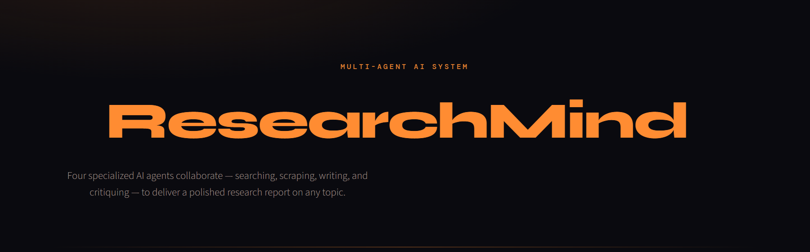

# ResearchMind


A multi-agent AI research system that searches, scrapes, writes, and critiques — delivering a polished research report on any topic.

## Core Features

- **🔍 Search Agent** — Fetches recent, relevant web results via Tavily API
- **📄 Reader Agent** — Scrapes the most valuable source and extracts clean content
- **✍️ Writer Chain** — Synthesises search + scraped data into a structured, professional report
- **🧐 Critic Chain** — Reviews the report and provides a score, strengths, and areas to improve
- **🖥️ Streamlit UI** — Dark-themed dashboard with live pipeline progress tracking
- **⏱️ Auto-retry** — Handles API rate limits with exponential backoff
- **📥 Download** — Export reports as Markdown files



## Architecture

```
User Input (topic)
       │
       ▼
┌──────────────────┐
│  Search Agent    │  Tavily web search → top 5 results
│  (tool call)     │
└──────────────────┘
       │
       ▼
┌──────────────────┐
│  Reader Agent    │  Picks best URL → scrapes & extracts 3000 chars
│  (LLM + scrape)  │
└──────────────────┘
       │
       ▼
┌──────────────────┐
│  Writer Chain    │  LCEL: prompt → LLM → structured report
│  (LCEL pipeline) │
└──────────────────┘
       │
       ▼
┌──────────────────┐
│  Critic Chain    │  LCEL: prompt → LLM → score + feedback
│  (LCEL pipeline) │
└──────────────────┘
       │
       ▼
   Final Output
```

## Tech Stack

| Layer | Technology |
|---|---|
| Language | Python 3.12 |
| LLM | Groq (`openai/gpt-oss-20b`) |
| Search | Tavily API |
| Scraping | Requests + BeautifulSoup |
| Orchestration | LangChain (agents + LCEL chains) |
| UI | Streamlit |
| Package manager | uv |

## Project Structure

```
research-mind/
├── agents/
│   ├── search_agent.py      # Tavily-powered web search agent
│   └── reader_agent.py      # URL scraping & extraction agent
├── tools/
│   ├── web_search.py        # Tavily search tool wrapper
│   └── scrape_url.py        # BeautifulSoup scraper tool
├── utils/
│   ├── chains.py            # Writer & Critic LCEL pipelines
│   ├── config.py            # Environment & config loader
│   └── prompts.py           # Prompt templates
├── architecture/
│   └── research-mind.png    # Architecture diagram
├── public/
│   └── Dashboard.png        # UI screenshot
├── main.py                  # CLI entry point
├── app.py                   # Streamlit dashboard
├── pyproject.toml           # Dependencies & metadata
├── .env.example             # API key template
├── .python-version          # Python 3.12
└── README.md
```

## Local Setup

### Prerequisites

- Python 3.12+
- [uv](https://docs.astral.sh/uv/) installed
- API keys for [Groq](https://console.groq.com) and [Tavily](https://tavily.com)

### Installation

```bash
# Clone the repository
git clone <repo-url>
cd research-mind

# Create environment and install dependencies
uv sync

# Configure API keys
cp .env.example .env
```

Edit `.env` and add your keys:

```
TAVILY_API_KEY=tvly-xxxxxxxxxxxxxxxxxxxxxxxxxxxxxxxx
GROQ_API_KEY=gsk_xxxxxxxxxxxxxxxxxxxxxxxxxxxxxxxx
```

### Run

**CLI mode:**
```bash
uv run main.py
```

**Streamlit dashboard:**
```bash
uv run streamlit run app.py
```

## Usage

1. Enter a research topic (e.g. "Recent AI news and fundings")
2. The pipeline runs 4 stages — watch progress in real time
3. Read the generated report and critic feedback
4. Download the report as a `.md` file

## Live Demo

<!-- Add your deployed URL here -->
**[Launch ResearchMind →]()**

*URL will be added after deployment.*

## License

MIT
